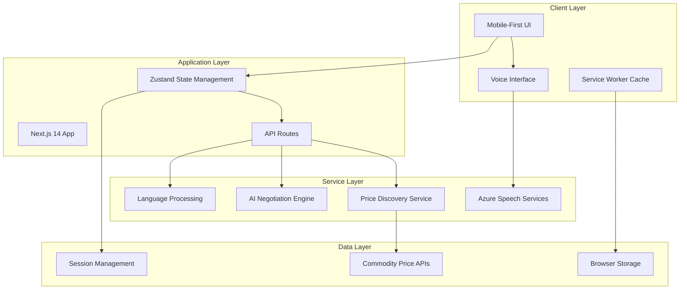

# Design Document: The Multilingual Mandi

## Overview

The Multilingual Mandi is a voice-first web application built with Next.js 14 that empowers India's wholesale traders through real-time price discovery and AI-powered negotiation assistance. The system prioritizes accessibility and multilingual support, targeting users with low tech literacy who primarily communicate in Hindi and regional languages.

The architecture follows a mobile-first, progressive enhancement approach with voice interaction as the primary interface. The system integrates Azure Cognitive Services for speech processing, real-time commodity price APIs for market data, and implements comprehensive caching strategies for offline functionality.

## Architecture

### System Architecture



### Technology Stack

- **Frontend**: Next.js 14 with App Router, TypeScript, Tailwind CSS
- **State Management**: Zustand for client-side state
- **Speech Processing**: Web Speech API + Azure Cognitive Services fallback
- **Styling**: Tailwind CSS with custom accessibility utilities
- **Caching**: Service Worker with Cache API for offline support
- **Performance**: Next.js built-in optimizations, image optimization, code splitting

## Components and Interfaces

### Core Components

#### VoiceInterface Component
```typescript
interface VoiceInterfaceProps {
  onSpeechResult: (text: string, language: string) => void;
  onSpeechError: (error: SpeechError) => void;
  isListening: boolean;
  supportedLanguages: Language[];
}

interface SpeechResult {
  transcript: string;
  confidence: number;
  language: string;
  timestamp: Date;
}
```

#### PriceDiscoveryDashboard Component
```typescript
interface PriceData {
  commodity: string;
  currentPrice: number;
  previousPrice: number;
  trend: 'up' | 'down' | 'stable';
  timestamp: Date;
  source: string;
  currency: string;
}

interface PriceDashboardProps {
  commodities: PriceData[];
  onPriceAlert: (commodity: string, targetPrice: number) => void;
  isOffline: boolean;
}
```

#### NegotiationSimulator Component
```typescript
interface NegotiationScenario {
  commodity: string;
  marketPrice: number;
  scenario: string;
  difficulty: 'beginner' | 'intermediate' | 'advanced';
}

interface NegotiationResponse {
  message: string;
  counterOffer?: number;
  tips: string[];
  whatsappTemplate: string;
}
```

#### LanguageProcessor Component
```typescript
interface LanguageConfig {
  code: string;
  name: string;
  nativeName: string;
  speechSupported: boolean;
  ttsSupported: boolean;
}

interface TranslationResult {
  originalText: string;
  translatedText: string;
  sourceLanguage: string;
  targetLanguage: string;
  confidence: number;
}
```

### Service Interfaces

#### Speech Service
```typescript
interface SpeechService {
  startListening(language?: string): Promise<void>;
  stopListening(): void;
  synthesizeSpeech(text: string, language: string): Promise<void>;
  detectLanguage(audioData: ArrayBuffer): Promise<string>;
  isSupported(): boolean;
}
```

#### Price Discovery Service
```typescript
interface PriceService {
  getCurrentPrices(commodities: string[]): Promise<PriceData[]>;
  subscribeToPriceUpdates(callback: (prices: PriceData[]) => void): void;
  getCachedPrices(): PriceData[];
  setPriceAlert(commodity: string, targetPrice: number): Promise<void>;
}
```

#### AI Negotiation Service
```typescript
interface NegotiationService {
  startNegotiation(scenario: NegotiationScenario): Promise<string>;
  processUserInput(input: string, context: NegotiationContext): Promise<NegotiationResponse>;
  generateWhatsAppMessage(negotiationResult: NegotiationResult): string;
  adaptDifficulty(userPerformance: PerformanceMetrics): void;
}
```

## Data Models

### Core Data Models

#### User Profile
```typescript
interface UserProfile {
  id: string;
  preferredLanguage: string;
  accessibilitySettings: AccessibilitySettings;
  tradingPreferences: TradingPreferences;
  sessionHistory: SessionData[];
}

interface AccessibilitySettings {
  highContrast: boolean;
  largeText: boolean;
  voiceSpeed: number;
  touchTargetSize: 'normal' | 'large' | 'extra-large';
}
```

#### Commodity Data
```typescript
interface Commodity {
  id: string;
  name: string;
  category: string;
  unit: string;
  aliases: Record<string, string[]>; // Language-specific aliases
  marketInfo: MarketInfo;
}

interface MarketInfo {
  exchanges: string[];
  tradingHours: TradingHours;
  seasonality: SeasonalityData;
  qualityGrades: string[];
}
```

#### Session Management
```typescript
interface SessionData {
  sessionId: string;
  userId: string;
  startTime: Date;
  endTime?: Date;
  interactions: Interaction[];
  dataUsage: number;
  performanceMetrics: PerformanceMetrics;
}

interface Interaction {
  type: 'voice' | 'touch' | 'price_query' | 'negotiation';
  timestamp: Date;
  input: string;
  output: string;
  language: string;
  success: boolean;
}
```

### State Management Schema

#### Global State (Zustand)
```typescript
interface AppState {
  // User state
  user: UserProfile | null;
  currentLanguage: string;
  
  // Voice state
  isListening: boolean;
  speechResult: SpeechResult | null;
  voiceError: string | null;
  
  // Price state
  prices: PriceData[];
  priceAlerts: PriceAlert[];
  isOffline: boolean;
  lastPriceUpdate: Date;
  
  // Negotiation state
  currentNegotiation: NegotiationSession | null;
  negotiationHistory: NegotiationResult[];
  
  // UI state
  activeView: 'dashboard' | 'negotiation' | 'settings';
  loading: boolean;
  error: string | null;
}
```

## Correctness Properties

*A property is a characteristic or behavior that should hold true across all valid executions of a system—essentially, a formal statement about what the system should do. Properties serve as the bridge between human-readable specifications and machine-verifiable correctness guarantees.*

After analyzing the acceptance criteria, I've identified properties that can be consolidated to eliminate redundancy while maintaining comprehensive coverage. For example, multiple timing-related properties can be combined into performance properties, and language-specific properties can be unified into multilingual support properties.

### Voice Interface Properties

**Property 1: Voice interface response timing**
*For any* user microphone activation, the Voice_Interface should begin recording within 500ms and process speech-to-text conversion within 2 seconds
**Validates: Requirements 1.1, 1.3**

**Property 2: Language detection accuracy and speed**
*For any* audio input in supported languages, the Language_Processor should detect the language with 95% accuracy within 1 second
**Validates: Requirements 1.2, 4.1**

**Property 3: Text-to-speech conversion timing**
*For any* text response in any supported language, the Voice_Interface should convert text to speech within 1 second
**Validates: Requirements 1.4**

**Property 4: Noise threshold handling**
*For any* audio input with background noise exceeding the threshold, the Voice_Interface should request user repetition
**Validates: Requirements 1.5**

**Property 5: Voice recognition fallback**
*For any* voice recognition failure, the Voice_Interface should provide fallback text input options
**Validates: Requirements 1.7**

### Price Discovery Properties

**Property 6: Price retrieval performance**
*For any* commodity price request, the Price_Discovery_Engine should retrieve current market data within 3 seconds
**Validates: Requirements 2.1**

**Property 7: Price trend visualization**
*For any* price data with trend information, the display should show correct color-coded visual indicators (green for up, red for down)
**Validates: Requirements 2.2**

**Property 8: Price staleness warnings**
*For any* price data older than 30 minutes, the system should display a staleness warning
**Validates: Requirements 2.3**

**Property 9: Offline caching and indication**
*For any* network unavailability scenario, the system should cache price data and clearly indicate offline mode when displaying cached data
**Validates: Requirements 2.4, 2.5**

**Property 10: Price alert notifications**
*For any* price alert with target price, the system should notify users when the commodity price reaches the target
**Validates: Requirements 2.7**

### AI Negotiation Properties

**Property 11: Negotiation scenario generation**
*For any* negotiation practice session, the Negotiation_Simulator should present scenarios based on current market prices
**Validates: Requirements 3.1**

**Property 12: Negotiation response timing and context**
*For any* voice input during negotiation, the system should respond with contextually appropriate counter-offers within 3 seconds
**Validates: Requirements 3.2**

**Property 13: WhatsApp message generation with language preference**
*For any* completed negotiation practice, the system should generate WhatsApp message templates in the user's preferred language including relevant market data
**Validates: Requirements 3.3, 3.5**

**Property 14: Adaptive difficulty adjustment**
*For any* user with multiple negotiation sessions, the system should adapt difficulty based on performance patterns
**Validates: Requirements 3.4**

**Property 15: Voice-guided negotiation tips**
*For any* user request for tips during negotiation, the system should provide voice-guided negotiation strategies
**Validates: Requirements 3.7**

### Multilingual Support Properties

**Property 16: Session language persistence**
*For any* detected user language during a session, the Language_Processor should maintain that language preference throughout the entire session
**Validates: Requirements 4.2**

**Property 17: Translation accuracy preservation**
*For any* content translation, the Language_Processor should preserve technical terminology and pricing information accurately
**Validates: Requirements 4.3**

**Property 18: Translation fallback behavior**
*For any* translation failure, the Language_Processor should fall back to Hindi as the default language
**Validates: Requirements 4.5**

**Property 19: Consistent multilingual translation**
*For any* UI text, voice response, or generated message, the Language_Processor should translate all content types consistently
**Validates: Requirements 4.6**

**Property 20: Regional number formatting**
*For any* number or price display, the Language_Processor should use appropriate regional number formats for the detected language
**Validates: Requirements 4.7**

### Mobile UI and Accessibility Properties

**Property 21: Touch target accessibility compliance**
*For any* interactive element in the Mobile_UI, the touch target should have minimum 44px dimensions
**Validates: Requirements 5.1**

**Property 22: Contrast ratio compliance**
*For any* text element, the Mobile_UI should maintain contrast ratios of at least 4.5:1 for normal text and 3:1 for large text
**Validates: Requirements 5.2**

**Property 23: Responsive layout adaptation**
*For any* screen width between 320px and 768px, the Mobile_UI should adapt layout without functionality loss in both portrait and landscape orientations
**Validates: Requirements 5.3, 5.4**

**Property 24: Assistive technology compatibility**
*For any* user with accessibility needs, the Mobile_UI should be compatible with screen readers and voice assistants
**Validates: Requirements 5.5**

**Property 25: Interaction feedback timing**
*For any* user interaction, the Mobile_UI should provide visual feedback within 100ms
**Validates: Requirements 5.6**

**Property 26: Network resilience and loading indicators**
*For any* slow network condition, the Mobile_UI should show loading indicators and maintain responsiveness
**Validates: Requirements 5.7**

### Performance and Data Efficiency Properties

**Property 27: Application load performance**
*For any* user accessing the application on 4G networks, the system should load the main interface within 3 seconds
**Validates: Requirements 6.1**

**Property 28: Voice processing performance threshold**
*For any* batch of voice commands, the Voice_Interface should respond within 2 seconds for at least 90% of queries
**Validates: Requirements 6.2**

**Property 29: Session data usage limits**
*For any* user session, the system should limit data usage to less than 10MB
**Validates: Requirements 6.3**

**Property 30: Image optimization implementation**
*For any* image display, the system should use optimized formats and progressive loading
**Validates: Requirements 6.4**

**Property 31: Offline functionality with cached data**
*For any* offline scenario, the system should provide access to cached price data and basic functionality
**Validates: Requirements 6.6**

**Property 32: Voice data compression**
*For any* voice data transmission, the system should compress data to minimize bandwidth usage
**Validates: Requirements 6.7**

### Data Accuracy and Reliability Properties

**Property 33: Price timestamp precision**
*For any* commodity price display, the system should show data timestamps with minute-level precision
**Validates: Requirements 7.1**

**Property 34: Price data conflict resolution**
*For any* conflicting price data from multiple sources, the Price_Discovery_Engine should use weighted averaging with source reliability factors
**Validates: Requirements 7.2**

**Property 35: Price data validation and flagging**
*For any* price data outside acceptable market ranges, the system should validate, flag suspicious prices, and request manual verification
**Validates: Requirements 7.3, 7.4**

**Property 36: Price history maintenance**
*For any* price data received, the system should maintain price history for trend analysis and accuracy verification
**Validates: Requirements 7.5**

**Property 37: Error logging and data attribution**
*For any* system error, the system should log detailed error information, and for any displayed data, provide source attribution for transparency
**Validates: Requirements 7.6, 7.7**

### Session Management Properties

**Property 38: Session timeout and re-authentication**
*For any* user login, the system should maintain active session for 8 hours of inactivity and provide seamless re-authentication options when session expires
**Validates: Requirements 8.1, 8.2**

**Property 39: Cross-session preference persistence**
*For any* user language preference or price alert, the system should persist these settings across sessions until manually changed or removed
**Validates: Requirements 8.3, 8.4**

**Property 40: User interaction tracking and state persistence**
*For any* user interaction pattern and application state, the system should track interactions for personalization and save current state for restoration when application is closed
**Validates: Requirements 8.5, 8.6**

**Property 41: Session timeout warnings**
*For any* active session approaching expiration, the system should provide timeout warnings 5 minutes before expiration
**Validates: Requirements 8.7**

## Error Handling

### Error Categories and Strategies

#### Voice Processing Errors
- **Speech Recognition Failures**: Implement graceful degradation to text input with clear user guidance
- **Language Detection Errors**: Fall back to Hindi with option for manual language selection
- **Audio Quality Issues**: Provide feedback on audio quality and suggest environmental improvements
- **Network Connectivity**: Cache voice models locally where possible, queue requests for retry

#### Price Data Errors
- **API Failures**: Use cached data with clear staleness indicators and retry mechanisms
- **Data Validation Errors**: Flag suspicious data, log for review, and exclude from calculations
- **Network Timeouts**: Implement exponential backoff and circuit breaker patterns
- **Rate Limiting**: Queue requests and implement fair usage policies

#### Multilingual Processing Errors
- **Translation Failures**: Fall back to original language with error indication
- **Character Encoding Issues**: Implement robust UTF-8 handling and validation
- **Regional Format Errors**: Use safe defaults with user override options

#### Mobile UI Errors
- **Responsive Layout Issues**: Implement progressive enhancement with mobile-first approach
- **Touch Target Problems**: Provide alternative interaction methods for accessibility
- **Performance Degradation**: Implement performance budgets and monitoring

### Error Recovery Mechanisms

#### Automatic Recovery
- Retry failed API calls with exponential backoff
- Automatically switch to cached data when network fails
- Re-establish WebSocket connections for real-time updates
- Clear corrupted local storage and reinitialize

#### User-Assisted Recovery
- Provide clear error messages in user's preferred language
- Offer manual refresh options for stale data
- Allow users to report data accuracy issues
- Provide offline mode toggle for manual control

## Testing Strategy

### Dual Testing Approach

The testing strategy employs both unit testing and property-based testing to ensure comprehensive coverage:

**Unit Tests**: Focus on specific examples, edge cases, and integration points between components. These tests validate concrete scenarios and ensure proper error handling for known failure modes.

**Property Tests**: Verify universal properties across all inputs using randomized test data. These tests catch edge cases that might not be considered in unit tests and validate system behavior across the full input space.

### Property-Based Testing Configuration

- **Testing Library**: Use `fast-check` for TypeScript/JavaScript property-based testing
- **Test Iterations**: Minimum 100 iterations per property test to ensure statistical confidence
- **Test Tagging**: Each property test must reference its design document property using the format:
  ```typescript
  // Feature: multilingual-mandi, Property 1: Voice interface response timing
  ```

### Unit Testing Focus Areas

- **Component Integration**: Test interactions between VoiceInterface, PriceDiscovery, and LanguageProcessor components
- **Error Boundaries**: Verify error handling and recovery mechanisms
- **Accessibility Features**: Test screen reader compatibility and keyboard navigation
- **Offline Functionality**: Verify service worker caching and offline mode behavior
- **Performance Thresholds**: Test load times and response times under various conditions

### Testing Environment Setup

- **Mobile Testing**: Use device emulation and real device testing for touch targets and responsive design
- **Network Simulation**: Test various network conditions including 2G, 3G, 4G, and offline scenarios
- **Language Testing**: Verify functionality across all supported languages with native speakers
- **Accessibility Testing**: Use automated tools (axe-core) and manual testing with assistive technologies
- **Performance Testing**: Implement performance budgets and continuous monitoring

### Continuous Integration

- **Automated Testing**: Run all tests on every commit with parallel execution
- **Performance Monitoring**: Track Core Web Vitals and custom performance metrics
- **Accessibility Audits**: Automated WCAG 2.1 AA compliance checking
- **Cross-Browser Testing**: Verify functionality across Chrome, Firefox, Safari, and Edge
- **Mobile Device Testing**: Test on various Android and iOS devices